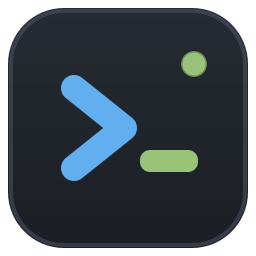
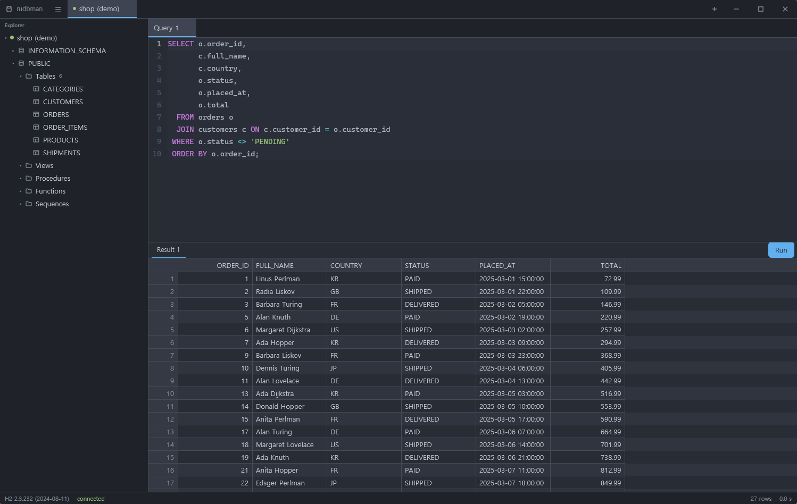
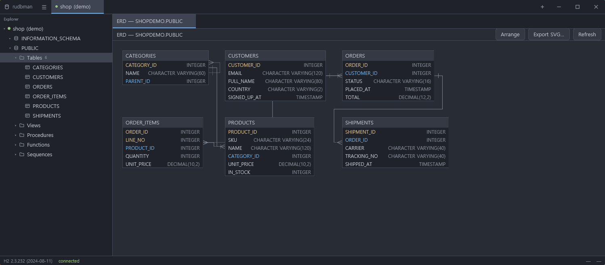
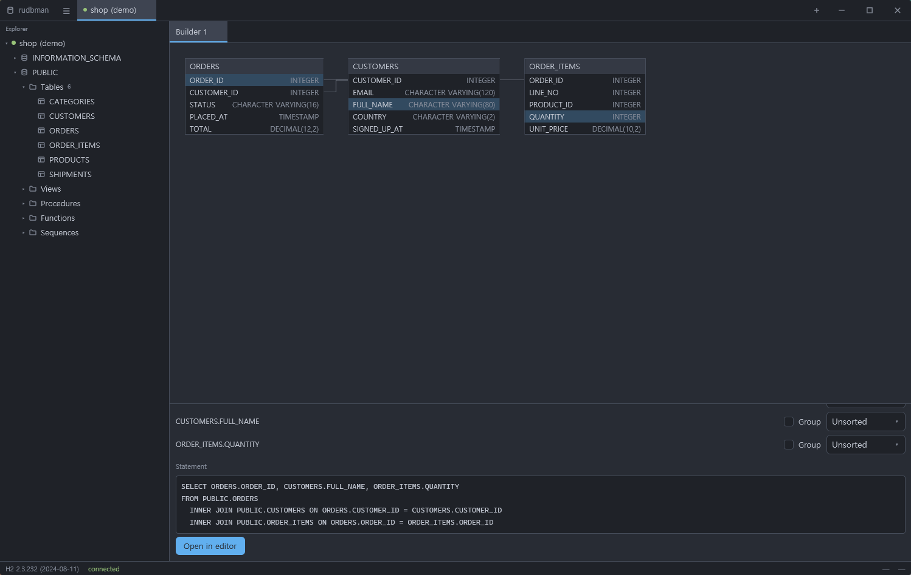

#  rudbman

[](https://github.com/xcomart/rudbman/actions/workflows/ci.yml)
[](LICENSE)


A multi-platform GUI database workbench written in Rust, built on
[gpui](https://gpui.rs) — the GPU-accelerated UI framework behind the Zed
editor — that talks to any database with a JDBC driver through an embedded
JVM bridge.

> **Status: early releases.** Everything below works today. Expect the rough
> edges of a first release; see [docs/status.md](docs/status.md) for what is
> known to be missing.



<p align="center">
  
  
</p>

## What works today

- **Any JDBC driver.** Drivers are downloaded from Maven Central by
  coordinate or picked from disk, the driver class is auto-detected from the
  JAR, and each connection gets its own isolated class loader. Row data
  crosses the JNI boundary in a compact columnar batch format — not as one
  JSON string per row.
- **Connections as tabs**, each with its own work area: split panes, tabbed
  editors and table details, per-connection query numbering. Switching the
  connection tab switches the explorer and the whole work area with it. With
  nothing open, a welcome screen lists the saved connections and opens one in
  a click.
- **SSH tunnels** with password or private-key auth, loopback binds only,
  and no PTY on the bastion — `nologin` jump hosts work. Secrets live in the
  OS keychain, never on disk, and credentials are masked out of logs and
  JDBC URLs.
- **A schema explorer** — catalogs, schemas, tables, views, sequences,
  routines — and a table detail panel with columns, keys, references in both
  directions, and DDL (the server's own text where the dialect offers it,
  reconstructed from metadata where it does not).
- **A SQL workbench**: an editor with incremental dialect-aware highlighting
  and IME support, statement splitting, run-one/run-selection/run-all,
  cancellation, multiple result sets, and a virtualized grid that scrolls a
  million rows without loading a million rows.
- **ERD diagrams** of a whole schema or catalog, from the explorer with
  <kbd>Ctrl</kbd>/<kbd>Cmd</kbd>+<kbd>E</kbd>. Tables are placed by a
  hierarchical (Sugiyama) layout of rudbman's own and joined by orthogonal
  routed edges; drag a table and the new position is saved per connection and
  restored next time. Export the diagram as SVG.
- **A visual query builder.** Drag tables out of the explorer onto a canvas,
  click columns to toggle them into the `SELECT` list, and drag column to
  column to join (`INNER`, `LEFT`, `RIGHT`, `FULL`). Forms cover `WHERE`,
  `GROUP BY` and `ORDER BY`, the SQL preview updates as you go with
  identifiers quoted the way the dialect wants them, and one click opens the
  statement in an editor.
- **Backup** of a schema or catalog to a replayable `.sql`: every `CREATE`
  first, every foreign-key `ALTER` after, then `INSERT`s ordered by a
  topological sort of the foreign keys, optionally gzipped, with progress and
  cancellation.
- **DB-to-DB transfer.** Copy tables between two open connections, by plain
  insert or by upsert — `MERGE`, `ON CONFLICT` or `ON DUPLICATE KEY` as the
  target dialect spells it. On a bad row, abort, skip it, or log it and carry
  on (batches are isolated with savepoints so one bad row does not cost the
  batch), with per-row progress for both copied and skipped rows.
- **Script extraction**: any table to a replayable `.sql`, to CSV, or
  through a user template — streamed to the file inside the JVM with progress
  and cancellation. Script execution is the same editor pipeline: open a
  `.sql` file, run it, get per-statement errors.
- **Context menus** on every surface that has actions worth reaching for —
  the explorer tree, the result grid, the editor, the ERD and builder
  canvases, and the tab strips.
- **Themes and languages**: UI and editor theme registries with live
  preview, import/export, and a user theme directory; eight UI languages
  (en, ko, ja, zh-CN, de, es, fr, ru).

## Installing

Download the build for your platform from
[Releases](https://github.com/xcomart/rudbman/releases). **No JDK needed** —
every download carries a Java runtime built with `jlink`, and rudbman uses the
one next to its executable.

- **Windows** — two downloads, the same program inside.
  - `…-setup.exe` is an installer. It installs into your user profile, so it
    needs no administrator rights and raises no UAC prompt, and it adds a
    Start-menu entry plus an **Apps & features** entry you can uninstall from
    later. Uninstalling removes only the program: settings, themes and saved
    connections stay.
  - `….zip` is the same tree, portable. Unzip it wherever you like and run
    `rudbman.exe` from inside the folder — keep the folder together, because
    the executable finds its Java runtime and bridge JAR beside itself.

  Either way the executable is self-signed at best, so SmartScreen may say
  "Windows protected your PC"; choose **More info → Run anyway**.
- **macOS** — unpack the `.tar.gz` and drag `rudbman.app` to Applications.
  The bundle is ad-hoc signed rather than notarized, so Gatekeeper quarantines
  it on arrival: the first launch needs **right-click → Open** instead of a
  double-click, and if macOS still refuses (newer versions offer no way
  through), drop the quarantine flag and launch normally:

  ```sh
  xattr -r -d com.apple.quarantine /Applications/rudbman.app
  ```

  On macOS 15 and later there is a second hurdle. The system asks each app
  separately for permission to reach the local network, and because the
  bundle is only ad-hoc signed it usually never gets the prompt and never
  appears under **System Settings → Privacy & Security → Local Network**,
  which offers no way to add an app by hand. The permission is then denied
  silently: connections to a database on your LAN — a `192.168.x.x` or
  `10.x.x.x` address, or a `.local` name — fail with "No route to host",
  while `localhost` connections work as usual. The dependable way through is
  to launch the binary from Terminal, whose execution context is always
  allowed on the local network:

  ```sh
  /Applications/rudbman.app/Contents/MacOS/rudbman
  ```

  It has to be the executable itself; `open rudbman.app` hands the launch to
  launchd and does not count. If you would rather try to get the prompt
  back, run `tccutil reset All com.aihouse.rudbman`, delete every copy of
  `rudbman.app` (empty the Trash too), reboot, then reinstall and launch —
  with an ad-hoc signature it may or may not ask. Updating to macOS 15.2 or
  newer, which fixed several of these cases, also helps.
- **Linux** — unpack the `.tar.gz` and run `./install.sh`. It copies the tree
  to `~/.local/share/rudbman`, links it from `~/.local/bin/rudbman`, and
  installs the desktop entry and icons. Needs no root; make sure
  `~/.local/bin` is on your `PATH`.

To use a JDK of your own instead of the bundled runtime, point
`RUDBMAN_JAVA_HOME` at it (Java 17 or newer).

## Building

Prerequisites: stable Rust, and a JDK (17+) with Gradle wrapper support for
the bridge.

```sh
# The Java half first: the Rust build refuses to proceed without the bridge JAR.
cd bridge && ./gradlew build && cd ..

# Then the workspace.
cargo build --release
```

A build from source has no bundled runtime, so it looks for a JVM on the
system — `RUDBMAN_JAVA_HOME`, then `JAVA_HOME`, then the usual locations. Only
the release archives ship a runtime of their own.

Running the tests mirrors CI: the bridge suite first, then the Rust
workspace, whose integration tests boot a real JVM against a real in-memory
H2 (the driver JAR is found in the Gradle cache, or pointed at with
`RUDBMAN_TEST_H2_JAR`):

```sh
cd bridge && ./gradlew build && cd ..
cargo test --workspace
```

On Linux, gpui links against `libxkbcommon` (with its X11 half),
`wayland-client` and `fontconfig` development packages; see
[.github/workflows/ci.yml](.github/workflows/ci.yml) for the exact list.

Release archives are built by
[.github/workflows/release.yml](.github/workflows/release.yml) from a version
tag: Gradle, then `jlink`, then `cargo`, then packaging.

## Architecture

The design document — the JNI wire protocol, the columnar batch codec, the
data-plane rule that row data never crosses the JNI boundary, the SSH tunnel
lifecycle, and the milestone plan — lives in
[docs/architecture.md](docs/architecture.md). Current progress and
open items are tracked in [docs/status.md](docs/status.md).

`vendor/gpui` is a vendored copy of gpui 0.2.2 carrying six crash/hang
fixes, kept byte-identical with the same tree in
[logman](https://github.com/xcomart/logman) so fixes move between the two
projects as plain diffs.

## License

[MIT](LICENSE). The vendored gpui keeps its upstream license.
